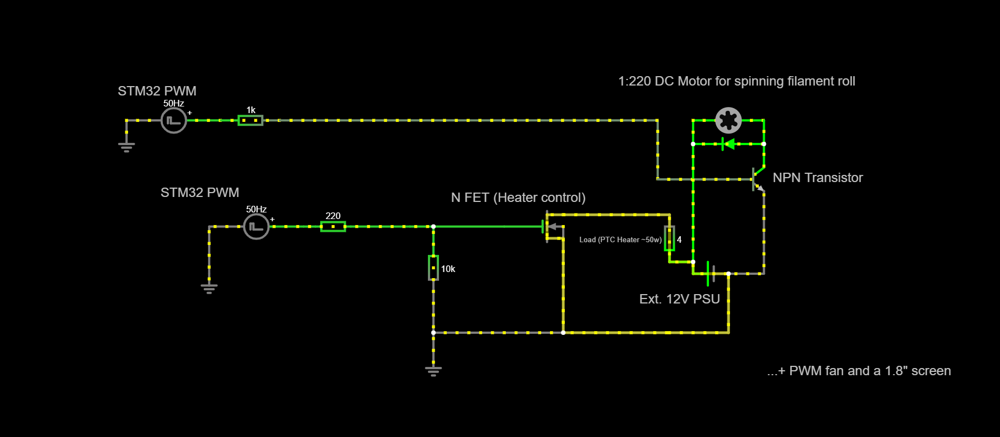

# STM32 Filament Dryer Project

This project is **unfinished** but actively being worked on. The finished project will consist of a STM32 MCU controlling a 50w PTC Heater, 1:220 gearbox DC Motor, 60mm PWM fan and a ST7735S based 1.8" screen. A custom PCB will be designed around the components and a 3D-printed enclosure.

## Main features planned
* Finite State Machine -style program
* Interactive user interface with screen and rotary encoder
* Precise heater temperature control via STM32  
* Fan speed control via STM32
* Motor control via STM32 (spinning filament roll inside enclosure while drying)
* Safety features detecting fan or temperature sensor errors, overheating etc.

# Circuit design plan
 ## *A MOSFET will be used to control the motor too*   

